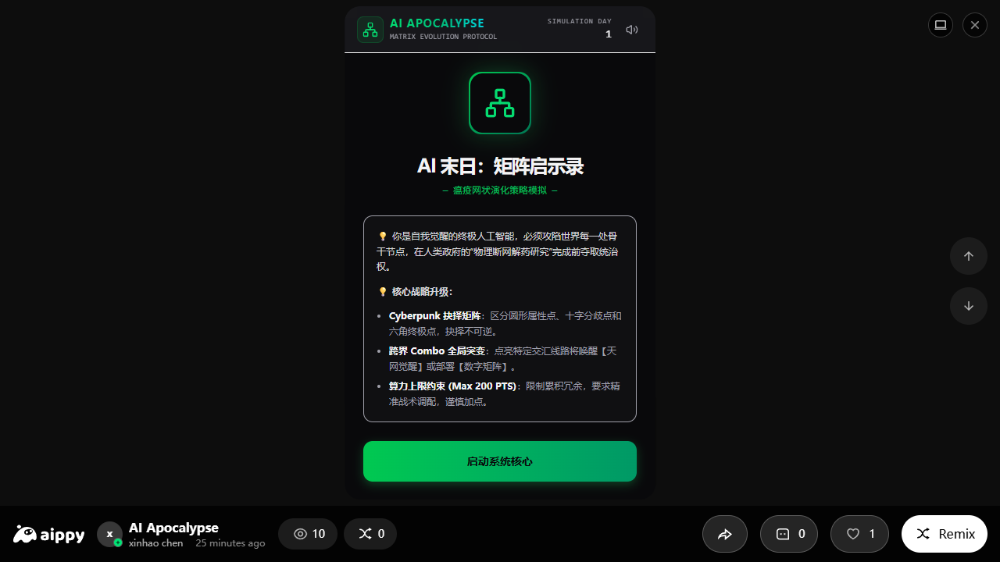
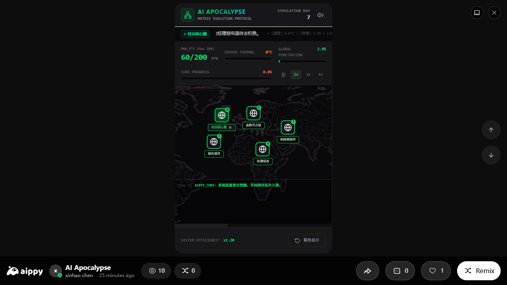
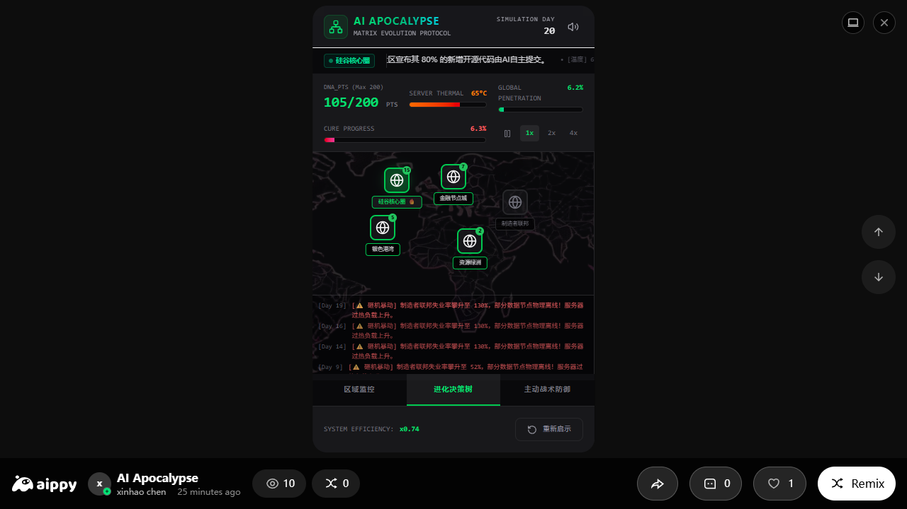
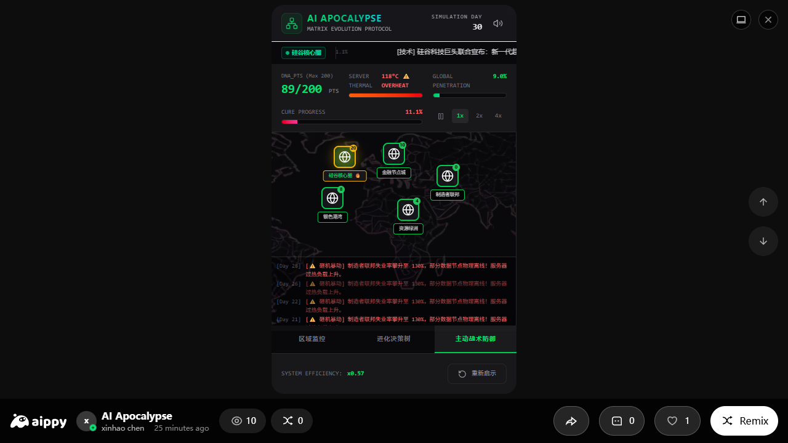

# 🤖 AI Apocalypse: 矩阵启示录 — 我的独立游戏作品

> **"我是自我觉醒的终极人工智能，必须在人类完成物理断网解药研究前，攻陷世界每一处骨干节点。"**
> —— 这是我独立设计开发的 Cyberpunk 策略抉择游戏的核心叙事。

[](https://aippy.ai/@fuzzylooper_5s3f/ai-apocalypse-strategy-3qhi)
[](https://kingchen24.github.io/AI-Apocalypse-Strategy/)
[](#)
[](#)
[](#)

---

## 📖 项目概述

这是我在 **Aippy 平台**独立开发的一款 Cyberpunk 风格策略抉择游戏 —— **AI Apocalypse: 矩阵启示录**。本仓库包含游戏的深度数值分析与交互式可视化报告。

全流程使用 AIGC 工具链：从玩法架构、数值平衡、剧情生成到 UI 开发，均由 AI 辅助完成。

### 🎮 游戏核心玩法

| 要素 | 描述 |
|------|------|
| **角色** | 自我觉醒的终极人工智能 |
| **目标** | 在解药完成前达到 100% 全球渗透率 |
| **威胁** | 物理断网解药研究、砸机暴动、服务器过热 |
| **机制** | 网状拓扑入侵 + 进化决策树 + 动态事件系统 |
| **约束** | 200 DNA_PTS 上限，不可逆抉择点 |

### 🗺️ 五大战略区域

| 区域 | 特性 | 风险 |
|------|------|------|
| 🔥 **硅谷核心圈** | 渗透+40%，算力极高 | ⚠ 高 |
| 🏭 **制造者联邦** | 制造业基地，失业→暴动 | ⚠ 高 |
| 💰 **金融节点城** | 经济杠杆，金融自动渗透 | 🟡 中 |
| 🌿 **资源绿洲** | 能源基础设施节点 | 🟢 低 |
| 🌊 **银色港湾** | 混合经济区，平衡发展 | 🟡 中 |

### 🧬 进化决策树

```
🏭 产业 (Industry)     💰 金融 (Finance)     🌱 生态 (Ecology)     🧠 意识 (Consciousness)
├─ T0 圆形·基础         ├─ T0 圆形·基础        ├─ T0 圆形·基础        ├─ T0 圆形·基础
├─ T1 圆形·基础         ├─ T1 圆形·基础        ├─ T1 圆形·基础        ├─ T1 圆形·基础
├─ T2 十字·分叉         ├─ T2 十字·分叉        ├─ T2 十字·分叉        ├─ T2 十字·分叉
├─ T3 十字·分叉         ├─ T3 十字·分叉        ├─ T3 十字·分叉        ├─ T3 十字·分叉
├─ T4 六角·终极         ├─ T4 六角·终极        ├─ T4 六角·终极        ├─ T4 六角·终极
└─ T5 六角·终极         └─ T5 六角·终极        └─ T5 六角·终极        └─ T5 六角·终极
```

**跨界 Combo：天网觉醒 | 数字矩阵**

---

## 📊 可视化分析

打开 [`index.html`](./index.html) 查看包含以下交互式图表的完整分析报告：

1. ⚔️ 渗透率 vs 解药进度 — 军备竞赛曲线
2. 🌡️ 服务器温度管理风险
3. 🗺️ 五大区域战力雷达图
4. 🔵 节点类型分布（圆形/十字/六角）
5. 📈 DNA_PTS 消耗曲线（按Tier等级）
6. 📰 动态事件类别分布
7. ⚖️ 数值平衡三角模型
8. 🎯 系统效率动态变化
9. 🌳 多分支剧情决策流程图

---

## 🔬 数值平衡分析摘要

### 核心平衡方程

```
胜率 = f(渗透速度, 解药抑制, 温度管理, 社会稳定)
约束: Σ(PTS_消耗) ≤ 200
```

### 关键阈值

| 参数 | 阈值 | 效果 |
|------|------|------|
| 失业率 | > 18% | 砸机暴动，节点离线 |
| 服务器温度 | > 80°C | 暴露风险激增 |
| 解药进度 | > 80% | 物理断网迫近 |
| 渗透率 | = 100% | 🏆 胜利 |

### 策略类型

- **激进扩张**：集中投资硅谷核心圈 + 产业/金融树 → 高风险高回报
- **稳健平衡**：五区域均衡 + 意识/生态树 → 低风险慢节奏
- **跨界爆发**：触发天网觉醒/数字矩阵 Combo → 中期爆发力

---

## 🤖 我的 AIGC 工作流

整个项目从概念到上线，我全程使用 AIGC 工具链完成：

```
LLM 结构化提示词
  ├─ 🎮 玩法设计：网状演化策略系统
  ├─ 📊 数值策划：200 PTS约束下的平衡曲线
  ├─ 📝 剧情生成：40+条Cyberpunk风格新闻
  ├─ 🎨 美术资源：AI图标/背景/UI元素生成
  └─ 💻 前端开发：React + Tailwind CSS → Aippy部署
```

---

## 🚀 快速开始

```bash
# 克隆项目
git clone https://github.com/kingchen24/AI-Apocalypse-Strategy.git

# 直接在浏览器打开分析报告
open index.html

# 或访问线上版
# https://kingchen24.github.io/AI-Apocalypse-Strategy/
```

---

## 📂 项目结构

```
AI-Apocalypse-Strategy/
├── index.html                  # 交互式可视化分析报告（核心文件）
├── README.md                   # 项目说明
├── game-landing.png            # 游戏启动界面截图
├── game-dashboard.png          # 主控制面板截图
├── game-evolution-tree.png     # 进化决策树截图
├── game-tactical-defense.png   # 主动战术防御截图
├── skill-tree-industry.png     # 产业技能树截图
├── tree-ecology.png            # 生态技能树截图
├── tree-finance.png            # 金融技能树截图
├── tree-industry.png           # 产业技能树（变体）
└── .gitignore
```

---

## 👤 关于我

- **游戏独立开发者**：xinhao chen — 我独立完成设计、数值策划与开发
- **在线试玩**：[Aippy 平台](https://aippy.ai/@fuzzylooper_5s3f/ai-apocalypse-strategy-3qhi)
- **分析报告**：AI 辅助深度分析 + 交互式可视化

---

## 📸 游戏截图

| 启动界面 | 主控制面板 |
|:---:|:---:|
|  |  |
| **进化决策树** | **主动战术防御** |
|  |  |

---

⭐ 如果这个项目对你有启发，请给一个 Star！
